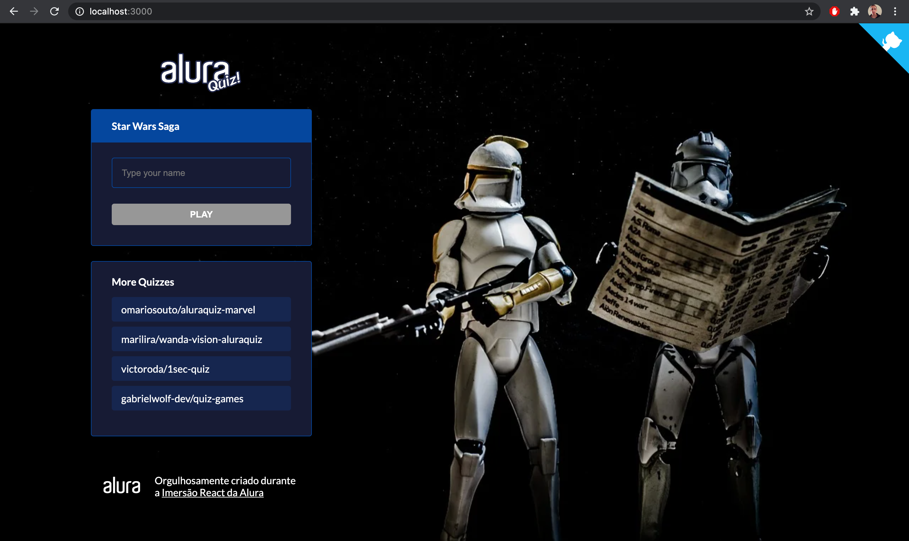

## Project title
Star Wars saga quiz based on "Imersão Alura"

## Motivation
Learn about Next.js, React and JavaScript.

## Build status


## Code style
[](https://github.com/feross/standard)
 
## Screenshots
### Home
In this page is possible to init the quiz about the Star Wars or try other quizzes


## Tech/framework used
<b>Built with</b>
- [React](https://reactjs.org/)
- [Next.js](https://nextjs.org/)
- [styled components](https://styled-components.com/)
- [FramerMotion](https://www.framer.com/motion/)
- [LottieFiles](https://lottiefiles.com/)

<b>Deploy</b>
- [Vercel](https://vercel.com/)

## Features
What makes your project stand out?

## Code Example
```javascript
<Footer 
    as={motion.section}
    transition={{ delay: 0, duration: 0.5 }}
    variants={{
      show: { opacity: 1, y: '0' },
      hidden: { opacity: 0, y: '100%' },
    }}
    initial="hidden"
    animate="show"
  />
```

## Installation
Using npm 
``npm run dev``

## Contribute

Create a new branch a do a pull request

## Credits
[Alura](https://www.alura.com.br/) 

[Juliana Amoasei](https://www.linkedin.com/in/juliana-amoasei/)

[Dev Soutinho](https://www.linkedin.com/in/omariosouto/)

[Paulo Silveira](https://www.linkedin.com/in/paulosilveira)

[Pixabay](https://pixabay.com/illustrations/starwars-star-wars-stormtrooper-2048262/)
